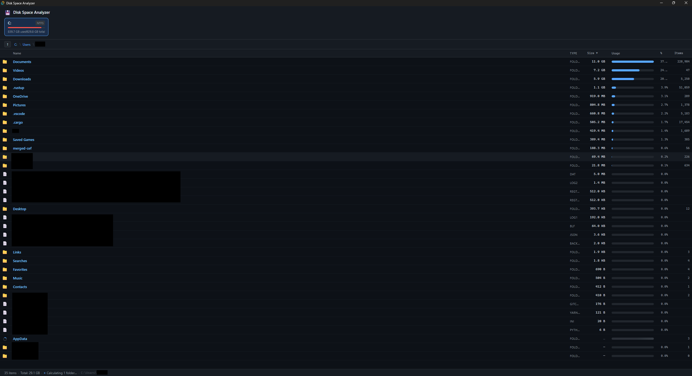
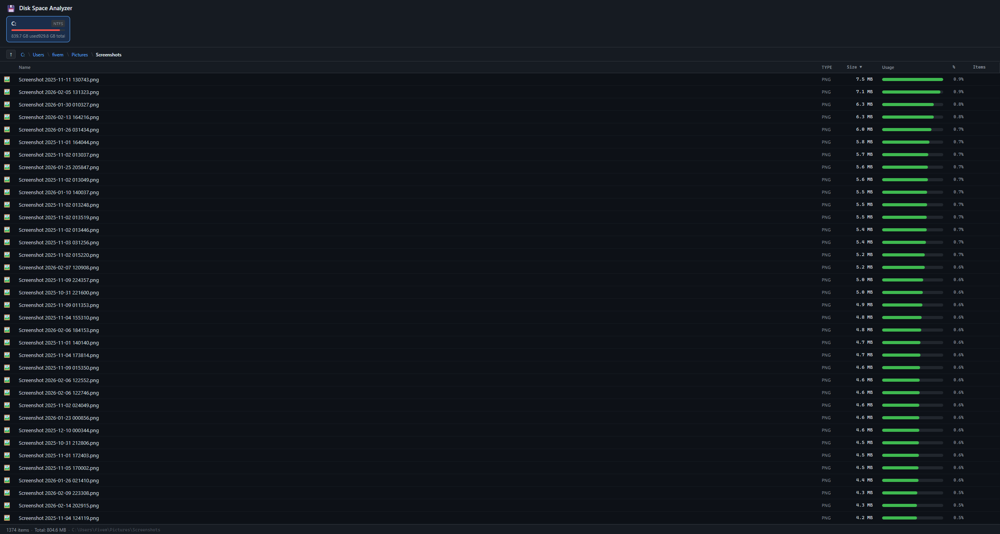

Trying to track what files are hogging space in Windows sucks. This program makes it better.

*This is vibecoded because I couldn't find the time to build this manually. The experience was both impressive and depressing.*